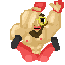
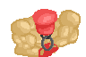
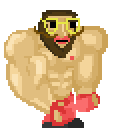
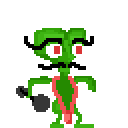

<span align="center">
  
</span>
<h1 align="center">PyGame MuscleMario</h1>


Made for


with


## Table Of Content

- [About](#about)
  - [Game showcase](#game-showcase)
  - [Used technologies](#used-technologies)
- [Running the game](#running-the-game)
- [Author](#author)
- [Links](#links)
- [Copyright](#copyright)

---

<p align="center">
  
</p>

<h1 align="center" id="about">About</h1>

Embark on an epic journey with Muscle Mario as he sets out to vanquish weakly green aliens in this action-packed 2D sidescroller created using Python and Pygame.

Get ready to flex those muscles and unleash your inner buff man with instructions in this [section](#running-the-game)!



Key Features of the game:

- Take control of the mighty `Muscle Man Mario`, a red hatted hero with bulging biceps on a mission to save the world from the `feeble green aliens`.



- `Four levels of feebility intensity (FLOFI)`! Brace yourself for four levels of increasing amount of enemies, each one a challenging iteration of the last.

- Navigate through an `overworld screen` where you can choose your desired level.


- Collect coins scattered throughout the levels to boost your score. These `coins` can be exchanged for `extra lives` to extend your gameplay upon facing defeat.

### Game showcase


### Used technologies

- **Programming language:** Python 3.11.4

- **Programming editor**: VScode

- **🕹️ Game engine**: [pygame 2.5.2](https://www.pygame.org/)

- **🖼️ Art and animations**:

[Piskelapp](https://www.piskelapp.com/)


- **🎶 Music**

Overworld and level music made with

[Beepbox.co](https://www.beepbox.co/)


Overworld.wav

<video alt="Overworld.wav" title="Overworld.wav" src="https://github.com/PiotrOtta/PythonGame_MuscleMario/assets/61495868/50338815-a6ad-496d-8ff4-a0b77df4b6c6" controls></video>

---

## Running the game

**Prerequisits:** `Python 3.11` and `PyGame 2.5.2`

You have to install `Python` atleast version `3.11` [Python downloads](https://www.python.org/downloads/)

and You need to install PyGame, e.g. using `pip`

```powershell
pip install pygame
```

Then all left to do is run the following command

```powershell
python main.py
```

---

## Author

- [Piotr Otta](https://github.com/PiotrOtta)

## Links

- [PyGame news page](https://www.pygame.org/news)
- [Piskelapp](https://www.piskelapp.com/)
- [Beepbox.co](https://www.beepbox.co/)

## Copyright 

<p xmlns:cc="http://creativecommons.org/ns#" xmlns:dct="http://purl.org/dc/terms/"><a property="dct:title" rel="cc:attributionURL" href="https://github.com/PiotrOtta/PythonGame_MuscleMario">PythonGame MuscleMario</a> by <a rel="cc:attributionURL dct:creator" property="cc:attributionName" href="https://github.com/PiotrOtta">Piotr Otta</a> is licensed under <a href="https://creativecommons.org/licenses/by-nc-sa/4.0/?ref=chooser-v1" target="_blank" rel="license noopener noreferrer" style="display:inline-block;">CC BY-NC-SA 4.0</a></p>

This game utilizes public libraries solely for educational and non-commercial purposes.

No part of this game or its content may be reproduced, distributed, or utilized for any commercial endeavors without the express written consent of the copyright holder.
